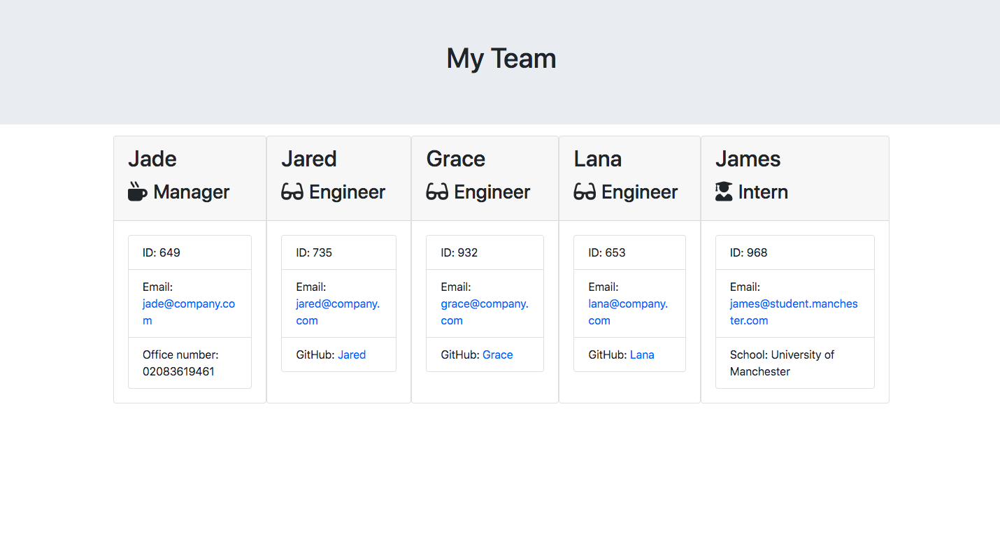

# team-profile-generator

## Description

This weeks challenge was to create a working node.js command-line application that takes information about a software engineering team and displays the relevant information onto a HTML page. The user story for the page is AS A manager, I WANT to generate a webpage that displays my team's basic info, SO THAT I have quick access to their emails and GitHub profile. 

## Usage

The HTML page loads to show all employees, with their name displayed on the card, as well as their job title. The cards itself shows their employee ID, email and either phone, github or school depending on their position. The image below shows the deployed site.

Here is a link to the git hub repository: https://github.com/shazzy-kawa/team-profile-generator.git
Here is a link to the github page:

## Credits

This site was created using the resources from the bootcamp as well as support from the instructors during office hours,

## License
This was created using an MIT license.

